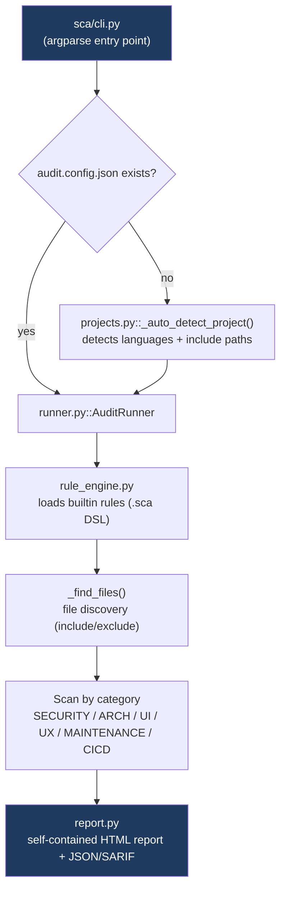

# Architecture — SCA Community Edition

This document explains **how** the engine works. For what it does and why
it's structured this way, see the main [README](README.md).

## Scope of this edition

SCA Community Edition ships a **Python-only taint engine** plus a small
set of pattern-based rules for Java, C#, PHP and JavaScript. The
multi-language dataflow engine (Java/C# call-graph resolution, the
lexical taint engine for Java/C#/PHP/JavaScript, Spring framework
detection) is part of the commercial engine and is not included here —
see the [README](README.md#community-edition-vs-full-engine) for the
exact split.

## Scan pipeline

There is no license or tier system in this edition — every command below
runs unconditionally.

## Rule format (`.sca` DSL)

Rules live in `sca/rules/builtin/{language}/{category}/*.sca`. Two
matching styles:

- **Pattern rules** (`match` block, regex-based) — used for every rule
  in this edition except the 10 Python taint rules. No source→sink
  tracking; a single regex match on a line (or file) is enough to flag
  it.
- **Taint rules** (`source`/`sink` blocks) — used only by the 10 Python
  security rules (`taint_sqli`, `taint_xss`, `taint_rce`, `taint_codeinj`,
  `taint_path_traversal`, `taint_xxe`, `taint_xpathi`, `taint_ldap`,
  `taint_open_redirect`, `taint_deserialization`). These track how a
  value flows from a source (e.g. an HTTP parameter) to a sink (e.g. a
  SQL query) across the function.

Every rule also carries `risk`/`solution`/`benefit` text in 4 languages
(en/fr/es/de) and a `metadata` block with at least one CWE id. To add
a new rule, see the worked example in
[USER-GUIDE.md](USER-GUIDE.md#adding-a-rule--worked-example).

## The Python taint engine

Located in `sca/dataflow/`:

- `cfg.py` — builds a control-flow graph from the Python AST.
- `lattice.py` — the taint lattice (`Tainted`/`Clean`/`⊤`) and state
  operations (join, widen).
- `transfer.py` — per-statement transfer function: how taint state
  changes across an assignment, a call, a branch.
- `worklist.py` — the fixed-point worklist algorithm (Kildall-style)
  that iterates transfer functions over the CFG until the state
  stabilizes.
- `summary.py` — intra-file function summaries (does calling this
  function with a tainted argument return a tainted value?), so taint
  can flow through a function call without re-analyzing its body from
  scratch every time.
- `call_graph.py` / `call_graph_cache.py` — a persistent, incremental
  call graph for cross-file resolution (a value tainted in file A,
  passed through file B, reaching a sink in file C is still detected),
  cached in `.sca-cache/` and invalidated by file hash.

Entry point: `sca/executors/dataflow_taint.py::run_taint_rule()`, wired
into the rule engine via `sca/executors/dataflow_adapter.py`.

## CLI (`sca/cli.py`)

| Option | Effect |
|---|---|
| `project_path` | Path to the project to audit (default: `.`) |
| `--init` | Interactively generates `audit.config.json` |
| `--quick` | Fast mode (security rules only) |
| `--no-cache` | Forces a full re-analysis (ignores the incremental cache) |
| `--fail-on-high` | Exit code 1 if a HIGH finding is present (CI/CD) |
| `--sarif` | Generates a SARIF 2.1.0 export (GitHub Code Scanning, GitLab SAST) |
| `--demo` | Generates an anonymized HTML report alongside the full one |
| `--lang fr\|en\|es\|de` | Report language |
| `--list-rules` | Lists every loaded rule |
| `--rules-match` | Checks every rule has matching fixtures (vulnerable + clean) |
| `--check-integrity` | Detects duplicate/orphan fixtures and rule_id collisions |

Full list: `./run_audit.py --help`.

## Output formats

| Format | Audience | Flag |
|---|---|---|
| HTML | Human reviewer (visual report + charts) | default |
| JSON | Automation / dashboards / CI | default |
| SARIF | IDE, GitHub Code Scanning, GitLab SAST | `--sarif` |
